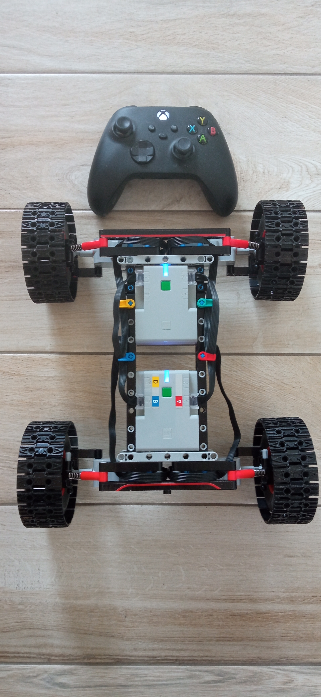

# LEGO Custom E-Tron

<p align="center">
  
</p>

<p align="center">
  Custom LEGO E-Tron project powered by **Pybricks** firmware.<br>
  This repository explores and documents various drivetrain and steering concepts for LEGO Technic vehicles.<br>
  From proven stable builds to experimental prototypes.
</p>

<p align="center">
  
</p>

---

## Structure

- **[`Stable builds`](scripts/stable/)** — Tested and verified programs. Reliable for reuse, demo, and everyday driving.

- **[`Experimental prototypes`](scripts/experimental/)** — Prototypes and unfinished concepts. Used for testing ideas and mechanical setups.

---

## Highlights

- Multiple drive configurations: 2× rear, front steer, 4×4, half-skid, and tracked
- Smooth acceleration control and turning logic
- Support for LEGO 88010 Remote and Xbox Controller
- Dual Technic Hub setup with Xbox Controller (BLE broadcast)
- Battery monitoring for LEGO Technic Hub
- Modular, readable Python code compatible with Pybricks

---

## Hardware & Requirements

- LEGO Technic Hub (Control+ / 4-port)
- LEGO L or XL motors
- LEGO 88010 Remote *(default)*
- Xbox Controller *(optional, supported in selected builds)*
- Pybricks firmware installed on Hub
- Wheels or tracks depending on variant

---

## Usage

1. Flash your Technic Hub with [Pybricks firmware](https://code.pybricks.com)  
2. Clone this repository:
   ```bash
   git clone https://github.com/<your-username>/lego-etron.git
   cd lego-etron
3. Choose a program from stable/
4. Upload it via Pybricks Code or run: pybricksdev run ble -n "Your hub name" .scripts/stable/drives/<script>.py

---

## Documentation

See:

- **[`Stable builds`](scripts/stable/)**
- **[`Experimental prototypes`](scripts/experimental/)**

---

## Status

🚗 Actively developed — multiple configurations tested and iterated.

## License

MIT

---

<p align="center">
  
</p>

---

> Built by [Radosław Milner](https://github.com/RadoslawMilner) using LEGO and lots of iterations 🚗🔧
